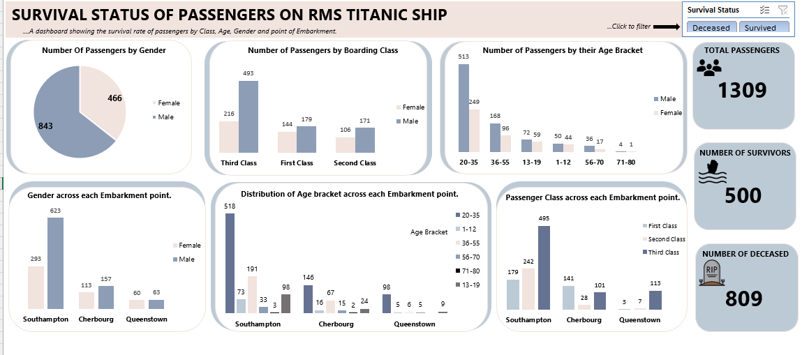

# SURVIVAL_STATUS_OF_PASSENGERS_ON_RSM_TITANIC_SHIP

## Project Overview
This project is aimed at determining the number of passengers that survived in the RSM
titanic ship wreckage and factors that could have aided their survival.

This Project was executed using Microsoft Excel from start (cleaning) to finish (visualization).
This project was created as part of a data analysis portfolio to demonstrate excel Dashboarding,
data summarization,story-telling and a clearer insight on the survivors.

---
## Project Questions Answered
- Total number of passengers on board?
- Total number of male and female passengers on board?
- Total number of male and female survivors?
- Influence of passengers class on survival status?
- Number of survivors from each embarkment point?
- Did Age play a role in survival status?

---
## Key Factors
- Total number of passengers
- Total number of survivors
- Total number of Deceased

---
## Tools Used
- Microsoft Excel
- Pivot Table
- Pivot Charts
- Excel Slicer
- Dashboard Design Technique

---

---
## Key Insights
- For every 1 female that died 5.37 men died.
- Third Class passengers recorded the highest death rate (65.27%).
- Passengers within the Age bracket of 20-35 recorded the highest death rate (61.19%).
- Southampton made up for most of the third class Passengers.
- Passangers from Southampton recorded the highest death rate (75.40%).

---
## Files in This Repository
- [README.md](README.md)
- [TITANIC DATASET](Titanic_Dashboard.xlsx)
- [Titanic Dashboard Screenshot](Titanic_Dashboard_Screenshot.png)

---
## Conclusion
From our analyses using Microsoft Excel, we can conclude that passengers survival was
hugely dictated by factors such as socio-economic status, age, and gender.
Women, children and first class passengers had the highest survival status. Which means
a strict "women and children first" protocol and systemic class biases during the accident 
was adopted in saving passengers.
